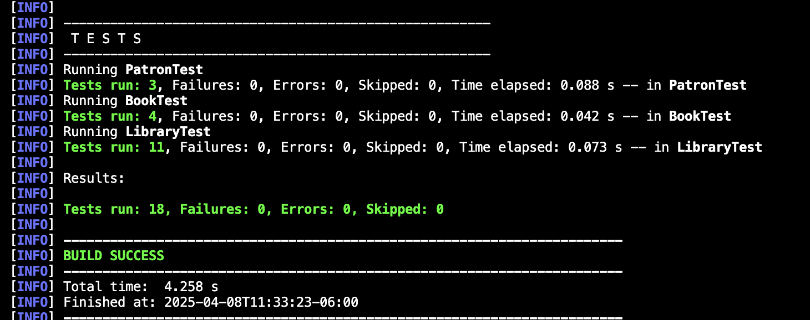

# UnitTesting

### Matrix of tests

| Feature / Class    | Test Case ID    | Unit Test Case Name                         | Test Scenario                                          | Input                                      | Expected Outcome                                               | Remarks                                                                                     |
|--------------------|-----------------|---------------------------------------------|--------------------------------------------------------|--------------------------------------------|----------------------------------------------------------------|---------------------------------------------------------------------------------------------|
| LibraryTest        | TC-LIB-001      | Add a duplicate book                        | Test adding a book that already exists in the library  | Book: "Harry Potter", Author: "JK Rowling" | First add returns true, second add returns false due to duplication | Tests book uniqueness in the library                                                            |
| LibraryTest        | TC-LIB-002      | Checkout an unavailable book                | Test checking out a book that has already been checked out | Book: "Algebra", Author: "Socrates"        | First checkout returns true, second checkout returns false        | Simulates a book that was already checked out by a patron                                        |
| LibraryTest        | TC-LIB-003      | Return a book not checked out               | Test attempting to return a book that was not checked out | Book: "Bajo la misma estrella", Author: "Green" | Return operation returns false due to the book not being checked out | Verifies that non-checked-out books cannot be returned                                         |
| LibraryTest        | TC-LIB-004      | Calculate fine for overdue book             | Test fine calculation for an overdue book              | Book: "Bajo la misma estrella", 7 days overdue | Fine of 5.00 is calculated for overdue book                       | Simulates overdue fine calculation based on due date                                            |
| LibraryTest        | TC-LIB-005      | List available books                        | Test listing books that are available for checkout     | Books: ["Book1", "Book2", "Book3", "Book4", "Book5"] | List contains only the available books (Book1, Book2, Book3)     | Verifies the proper listing of available books after some are checked out                        |
| LibraryTest        | TC-LIB-006      | List patrons                                | Test listing patrons added to the library              | Patrons: ["Juan Mario", "Juana Maria"]    | List contains both patrons                                        | Ensures that patrons are properly added and listed                                               |
| LibraryTest        | TC-LIB-007      | Add book                                    | Test adding a book to the library                      | Book: "1984", Author: "George Orwell"     | The book is added successfully to the library                      | Checks that the book is properly added to the list of available books                           |
| LibraryTest        | TC-LIB-008      | Remove a book from library                  | Test removing a book from the library                  | Book: "Sapiens", Author: "Yuval Harari"   | Book is removed and not found in available list                   | Ensures that books can be successfully removed from the library                                 |
| LibraryTest        | TC-LIB-009      | Return a book checked out by another patron | Test returning a book by a different patron            | Book: "Mystery", Patron: "Other"           | Return operation fails                                           | Confirms that only the patron who checked out the book can return it                           |
| LibraryTest        | TC-LIB-010      | Calculate fine for non-overdue book         | Test fine calculation for a book returned on time      | Book: "Fresh", due today                   | Fine is 0.0                                                     | Verifies that no fine is calculated if the book is not overdue                                 |
| LibraryTest        | TC-LIB-011      | Try to check out a non-existent book        | Test checking out a book that was never added          | Book: "Invisible", Author: "Ghost"         | Checkout fails                                                   | Confirms that only existing books in the library can be checked out                            |
| BookTest           | TC-BOOK-001     | Create a valid book                         | Test creating a valid book object                      | Book: "Turtles all the way down", Author: "Green" | Book object is created successfully                               | Verifies the creation of a book object with valid attributes                                     |
| BookTest           | TC-BOOK-002     | Check out a book sets due date              | Test that checking out a book sets its due date        | Book: "1984", checkout for 10 days         | Due date is 10 days from current date, book is marked as checked out | Ensures correct internal state and due date logic                                                  |
| BookTest           | TC-BOOK-003     | Return a book resets due date               | Test that returning a book clears due date and status  | Book: "1984", previously checked out       | Due date is null, book is marked as available                    | Ensures return logic resets all relevant book data                                               |
| BookTest           | TC-BOOK-004     | Set due date without checkout               | Test setting due date without checking out             | Book: "1984", set due date directly        | Throws IllegalStateException with correct message                | Validates defensive programming to avoid invalid state                                           |
| PatronTest         | TC-PATRON-001   | Create a valid patron                       | Test creating a patron                                 | Patron: "Camila Mendoza"                   | Patron object is created successfully                              | Ensures that a patron is created properly with a name                                            |
| PatronTest         | TC-PATRON-002   | Patron checks out and returns a book        | Test checking out and returning a book by a patron     | Book: "Algebra", Author: "Author"         | Book is checked out and returned successfully by the patron        | Verifies that a patron can check out and return books correctly                                  |
| PatronTest         | TC-PATRON-003   | Patron hasCheckedOutBook returns correct value | Test if method correctly checks book checkout status | Book: "Math", Patron: "Camila"             | Returns false before checkout, true after                        | Confirms proper book-tracking per patron                                                          |

### Evidence of the tests running

